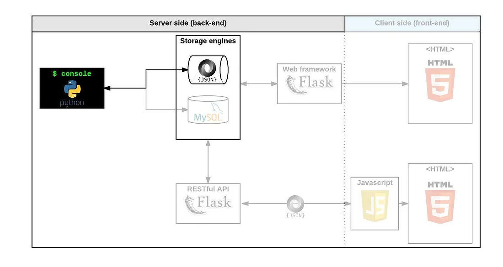

# 0x00. AirBnB clone - The console

## Background Context
The AirBnB clone project is a full-stack project that will take 4 months to complete. The goal is to to deploy on my server a simple copy of the AirBnB website. We will implement features one after another, covering all fundamental concepts of the higher-level programming stack. The complete website will be composed of:

1. A console interpreter. The console interpreter will manipulate data without a visual interface, like a shell.
2. The front-end. This will be the website that can be used by everyone.
3. A database to store data(Objects)
4. An API to connect the back-end to the front-end.

## Conceptes I need to learn
- Unittest
- Python packages
- `*args` and `**kwargs`
- `datetime`

## The Console
The console is a command line interpreter. It will help us play around with the data without the need of a developed website.
Completing the console lets us test out new ideas, tweak things and fix any issues smoothly.
It also helps us visualize how the whole project will fit together.



### Python Packages
Packages are a way to organize project files in different folders and subfolders based on some criteria. This helps us to manage them easier and more efficiently. Pyhton packages help us keep our code organized by structuring it into reusable components which are easier to manage and maintain.
To create python packages, we need to:

***1. Create a Directory***
This will serve as the root of your package structure.

***2. Add Modules***
Add Python files containing your code inside the directory. Each python file (module) should represent idstinct functionality or components of your package.

***3. Init File***
One of the Pyhton files should be named `__init__.py`. This can be an empty file, but it can also contain initialization code for your package.
The init file signals to python that the directory should be treated as a package.

***4. Subpackages***
Your package can contain subpackages.
Each subpackage is a sub-directory with Python files and an init file.

***5. Importing***
Import modules into your python script using dot notation.

***6. Distriution***
We can distribut our Python package by  creating a `setup.py` file using setuptools library in Python. This is a file containinng metadata about the package and specifies how it should be installed.

***AirBnB_clone Example Code***
```
AirBnB_Clone/
│
├── console.py
├── __init__.py
│
├── models/
│   ├── __init__.py
│   ├── base_models.py
│   └── engine/
│       ├── __init__.py
│       └── file_storage.py
│
└── tests/
    ├── __init__.py
    └── test_console.py
```
In the above example, we have the AirBnB_clone directory which is our Python package.
There are subpackages `models` and `tests` inside our main package.
the subpackage `models` has its own subpackage `engine`.
Each directory is initialized by its own `__init__.py` file.

### *args and **kwargs


### datetime

